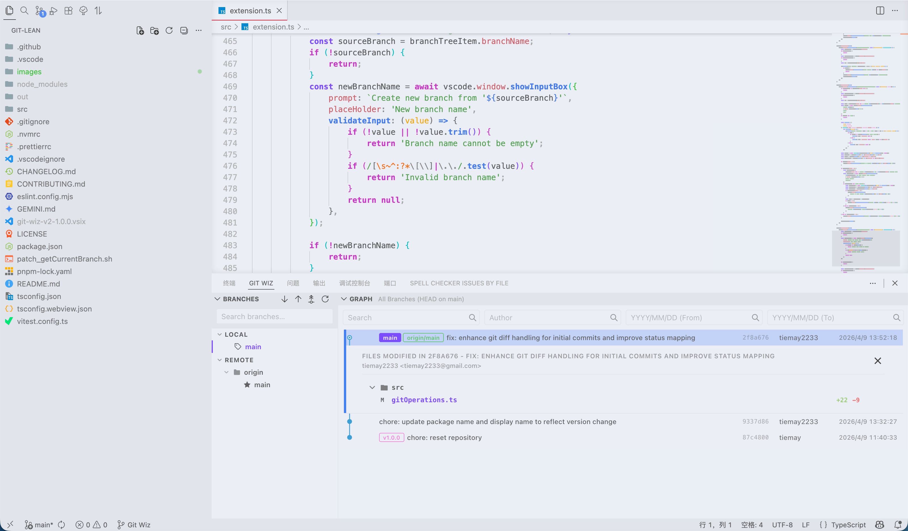

# Git Wiz

**A minimalist Git extension for Visual Studio Code.**

Git Wiz is dedicated to providing the purest Git interaction experience. We believe that "Less is More," rejecting bloated interfaces, complicated settings, and cluttered toolbars.

## Core Features

- **Branch Management Panel**: A clean branch tree view supporting both local and remote branches with instant double-click checkout. It displays the current branch name and offers fast filtering via a search box.
- **Dynamic Commit Graph**: High-performance Git history visualization rendered with pure Canvas, clearly showcasing merge relationships.
- **Enhanced Search Experience**: Filter commit history by hash, author, date, and more. The graph layout simplifies automatically during searches, with smooth "scroll-to-top" interactions.
- **View Title Sync**: Real-time display of the current branch information directly in the VS Code view title bar.

## Interaction Design

- **Double-Click Checkout**: Checkout local or remote branches instantly. Remote branches are automatically created with tracking enabled.
- **On-Demand Search**: Search filters trigger only after pressing `Enter` or clicking the search icon, preventing flickering during input.
- **Seamless Scrolling**: Automatically jumps to the top of the container after searching, with support for infinite scrolling of large repositories.

## Why Git Wiz?

Most Git extensions on the market are too heavy. Git Wiz was born to fill a gap: a lightweight tool that replaces complex GUIs while offering better visualization than a raw terminal. No extra fluff—just the branches and the graph you need.

## Requirements

- VS Code **1.75.0** or later
- Git installed on your system
- An open project that is a Git repository

