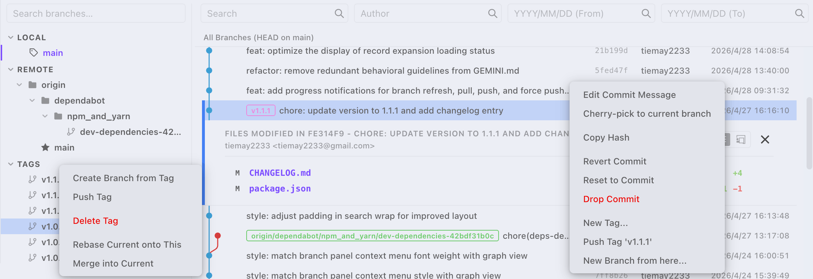

# GitWiz

一款极简 VS Code Git 扩展，提供画布渲染的提交图和可视化分支管理——无冗余，无干扰。



## 功能特性

### 提交图
- **提交历史** — 可滚动的提交列表，显示作者、日期和哈希值
- **分支路径图** — 分支/合并拓扑的可视化追踪（可开关）
- **高亮当前分支** — 浏览其他分支时自动淡化非当前分支的提交
- **文件差异视图** — 点击提交查看变更文件，内联显示增删行数
- **搜索** — 按提交信息、作者、哈希或日期范围搜索提交
  - **单轨模式** — 将提交图过滤为仅显示匹配的提交
  - **图模式** — 保持完整提交图可见，匹配项使用主题色高亮显示；日期范围仍会过滤显示的提交

### 分支管理
- **树形分支列表** — 包含 `/` 的分支（如 `feature/login`）自动归入文件夹分组
- **切换分支** — 切换到任意本地或远程分支（远程分支自动设置追踪）
- **创建分支** — 基于任意现有分支创建并切换到新分支
- **删除分支** — 安全检查（未合并警告、强制删除选项）
- **删除远程分支** — 从远程仓库删除分支
- **变基** — 将当前分支变基到另一个分支
- **合并** — 将另一个分支合并到当前分支
- **批量删除** — 选中多个分支一次性删除
- **批量文件夹删除** — 一键删除文件夹分组内的所有分支

### 标签管理
- **从标签创建分支** — 在标签位置创建新分支
- **推送标签** — 推送标签到远程仓库
- **删除标签** — 删除本地标签

### 提交操作（右键菜单）

| 操作 | 说明 |
|------|------|
| Cherry-pick | 将提交应用到当前分支 |
| 复制哈希 | 复制完整提交哈希到剪贴板 |
| 复制提交信息 | 复制提交描述文本到剪贴板 |
| 还原提交 | 创建还原提交 |
| 重置到此提交 | 软重置到该提交 |
| 删除提交 | 从历史中移除提交（需确认） |
| 压缩提交 | 将多个连续提交合并为一个 |
| 范围 Cherry-pick | 将一段提交范围应用到当前分支 |
| 范围还原 | 还原一段提交范围 |

### 远程操作
- **拉取** — 从所有远程仓库拉取
- **推送** — 推送当前分支（自动设置上游）
- **强制推送** — 使用 `--force-with-lease` 推送（需二次确认）
- **远程管理** — 在设置弹窗中添加/删除远程仓库

### 文件历史
- 在编辑器或文件浏览器中右键文件 → "Git Wiz: Show File History"，在提交图中过滤出该文件的所有提交
- 集成 VS Code 标准文件选择器

### 国际化
- 支持**简体中文**和**英文**
- 自动跟随 VS Code 显示语言
- 设置弹窗内容完整本地化

## 环境要求

- VS Code `^1.75.0`
- Node.js `>=24`
- pnpm `>=10`

## 安装

在 VS Code 扩展商店中搜索 **GitWiz** 安装，或从 [VS Code Marketplace](https://marketplace.visualstudio.com/items?itemName=tiemay.git-wiz-v2) 下载。

## 使用方法

### 打开提交图
- 点击状态栏的 **Git Wiz** 图标
- 或按 `Ctrl+Shift+P` 执行 `Git Wiz: Show Graph`
- 或在活动栏的源代码管理区域点击 **Git Wiz** 面板

### 工具栏按钮

提交图标题栏的操作按钮：

| 按钮 | 操作 |
|------|------|
| 拉取 | `git fetch --all` |
| 拉取（含合并） | `git pull` |
| 推送 | `git push`（自动设置上游） |
| 强制推送 | `git push --force-with-lease`（需确认） |
| 刷新 | 重新加载分支列表 |
| 设置 | 打开设置弹窗 |

### 分支面板右键菜单

| 菜单项 | 本地分支 | 远程分支 | 标签 |
|--------|---------|---------|------|
| 切换到此分支 | ✓ | ✓ | |
| 在此创建新分支 | ✓ | | |
| 从标签创建分支 | | | ✓ |
| 推送标签 | | | ✓ |
| 删除 | ✓ | | |
| 删除远程分支 | | ✓ | |
| 删除标签 | | | ✓ |
| 变基当前分支到此 | ✓ | ✓ | ✓ |
| 合并到当前分支 | ✓ | ✓ | ✓ |

## 配置

在 VS Code 设置中搜索 `git-wiz`：

| 设置项 | 默认值 | 说明 |
|--------|--------|------|
| `git-wiz.showStatusBarItem` | `true` | 显示状态栏图标 |
| `git-wiz.filesViewMode` | `"list"` | 文件默认视图：`list`（列表）或 `tree`（树形） |
| `git-wiz.commitDetailsViewMode` | `"list"` | 提交详情文件视图：`list` 或 `tree` |
| `git-wiz.highlightCurrentBranch` | `false` | 高亮当前分支的提交 |
| `git-wiz.showTags` | `true` | 在图中显示标签徽章 |
| `git-wiz.showRemoteBranches` | `true` | 显示远程分支名称 |
| `git-wiz.showGraph` | `true` | 显示分支路径图 |
| `git-wiz.searchDefaultMode` | `"single"` | 默认搜索模式：`single`（单轨）或 `graph`（图） |

以上选项也可通过提交图标题栏的**设置**按钮（齿轮图标）切换。

## 开发

```bash
# 克隆仓库
git clone https://github.com/tiemay2333/vscode-git-wiz.git

# 安装依赖
pnpm install

# 编译
pnpm run compile

# 监听模式（扩展宿主）
pnpm run watch

# 监听模式（Webview，保存即重新构建）
pnpm run watch:webview

# 运行测试
pnpm test
```

### 项目结构

```
src/
├── extension.ts              # 扩展入口，命令注册
├── gitGraphView.ts           # Webview 提供者，消息处理
├── gitOperations.ts          # Git 操作（checkout, merge, rebase 等）
├── gitParser.ts              # Git 日志输出解析器
├── git/                      # Git 运行器和变基脚本
├── webview/
│   ├── index.tsx             # Webview 入口
│   ├── graph/                # 提交图视图（React）
│   │   ├── GraphView.tsx     # 主图组件
│   │   ├── CommitRow.tsx     # 提交行（含引用徽章）
│   │   └── graphLayout.ts    # 分支路径图布局算法
│   ├── branches/
│   │   └── BranchPanel.tsx   # 分支树面板
│   └── settings/
│       ├── SettingsForm.tsx  # 设置弹窗表单
│       └── i18n.ts           # 国际化字典
└── webviewContent.ts         # Webview HTML 生成器
```

## 许可证

MIT
